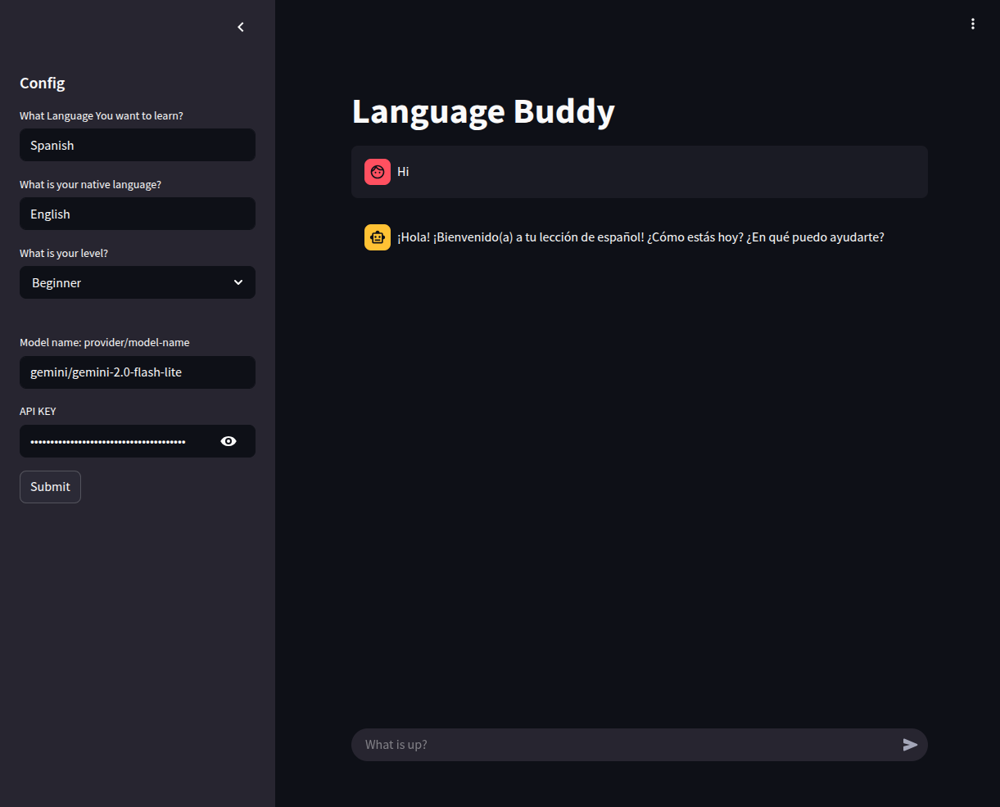

Read Documentation.md for the details of the project.

Watch the demo and explaination here: [https://youtu.be/jrD\_c6JuXLg](https://youtu.be/jrD_c6JuXLg)

How to run

1. Use Docker and goto [http://localhost:8501](http://localhost:8501)
> Note: must have docker installed
``` bash

git clone https://github.com/tikendraw/language_buddy.git
cd language_buddy
docker build -t myapp .  --debug ; docker run -p 8000:8000 -p 8501:8501 myapp
```

or
2\. Use Venv
```bash
git clone https://github.com/tikendraw/language_buddy.git

cd language_buddy
python -m venv .venv
source .venv/bin/activate
pip install .
uvicorn src.api:app --port 8000 --host 0.0.0.0 

# in a separate terminal
streamlit run src/app.py

```

